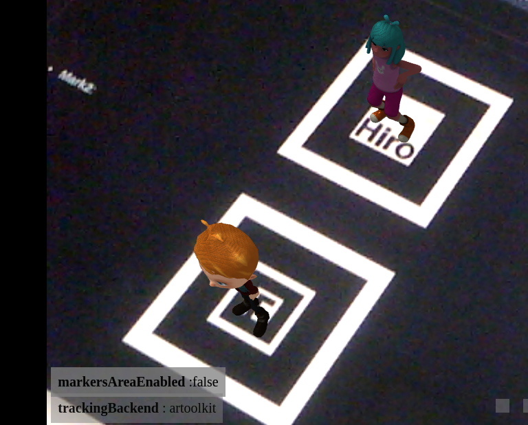

# Very Simple augmented reality page

This simple page shows how works ar.js. It's based in Francisco Estrada's blog ([https://blog.franciscoestrada.mx/tag/ar-js/](https://blog.franciscoestrada.mx/tag/ar-js/)) and Fabio Cortez medium article [https://medium.com/@fabiojcortes/manipulate-your-3d-content-with-gestures-in-ar-js-78da4c076607](https://medium.com/@fabiojcortes/manipulate-your-3d-content-with-gestures-in-ar-js-78da4c076607).

In order to test it, go to [https://gustavobastian.github.io/VR-second/](https://gustavobastian.github.io/VR-second/), you must have a camera connected to the computer.

For more information or documentation, go to [https://ar-js-org.github.io/AR.js-Docs/](https://ar-js-org.github.io/AR.js-Docs/).

For information about how to handle gestures [https://github.com/fcor/arjs-gestures](https://github.com/fcor/arjs-gestures)

## Marks for scanning

* <strong>Mark1</strong>:

*  <strong>Mark2</strong>:
  

## Credits

The 3d models used where download from <strong>Mixamo</strong> ( [https://www.mixamo.com/#/](https://www.mixamo.com/#/)).

## Some Ideas

You can use it in order to add some funny 3d models to party's invitation cards, personal contact cards, etc. Have fun!
